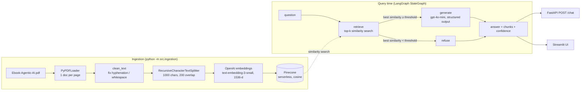

# Agentic AI eBook — RAG Chatbot

A Retrieval-Augmented Generation chatbot that answers questions **strictly** from the
[Agentic AI eBook](https://drive.google.com/file/d/15VLphKcY23_fpYxN62UEQRri_psRVfP9/view).
Built with **LangGraph** (workflow orchestration), **Pinecone** (vector store),
**OpenAI** (`text-embedding-3-small` + `gpt-4o-mini`) and exposed through a
**FastAPI** endpoint and a **Streamlit** chat UI.

Every response contains:

1. the generated answer (with inline `[n]` citations to the chunks it used),
2. the retrieved context chunks (text, page number, cosine similarity, cited flag),
3. a confidence score in `[0, 1]`.

Questions the eBook doesn't cover (e.g. *"Who won the 2022 FIFA World Cup?"*) are declined.

---

## Architecture



### LangGraph workflow (`src/graph.py`)

| Element | Responsibility |
|---|---|
| `AgentState` (TypedDict) | `question`, `context` (ranked chunks with page + similarity), `retrieval_score`, `answer`, `score`, `grounded`, `cited_chunks` |
| `retrieve` node | Embeds the question, fetches the top-k (`TOP_K=4`) chunks from Pinecone with their cosine similarity, ranks them and computes a normalised `retrieval_score`. |
| conditional edge | **Relevance gate** — if even the best chunk is below `RELEVANCE_THRESHOLD` (0.25) the question is off-topic, so the graph routes to `refuse` *without calling the LLM*. |
| `generate` node | Sends numbered context chunks to `gpt-4o-mini` (temperature 0) with a strict system prompt and forces a **structured response** (`answerable`, `answer`, `cited_chunks`, `confidence`). If the model reports the context is insufficient, the standard refusal is returned. |
| `refuse` node | Returns the refusal message with confidence `0.0`. |

`START → retrieve → (generate | refuse) → END`, compiled once with `workflow.compile()` and reused across requests.

### How grounding is enforced

1. **Retrieval gate** — cheap and deterministic; filters clearly unrelated questions.
2. **Prompt contract** — the model is told to use only the context, ignore prior knowledge,
   treat the context as data (prompt-injection hardening) and cite chunk numbers.
3. **Structured output** — the model must explicitly declare `answerable`; `false` ⇒ refusal.
4. **Citation validation** — citations to chunks that weren't retrieved are discarded, and an
   answer with no valid citation has its confidence halved.

### Confidence score

```
retrieval_score  = clamp((best_cosine − 0.20) / (0.65 − 0.20), 0, 1)
confidence_score = 0.6 × llm_confidence + 0.4 × retrieval_score     (grounded answers)
confidence_score = 0.0                                              (refusals)
```

`llm_confidence` is the model's self-assessed support level (rubric in the system prompt).
Raw cosine similarities from `text-embedding-3-small` rarely exceed ~0.7, so they are rescaled
to a 0–1 range (`SIMILARITY_FLOOR` / `SIMILARITY_CEILING` are configurable). The raw similarity
of every chunk is also returned so the score is fully explainable.

---

## Project structure

```
agentic-ai-rag-chatbot/
├── data/
│   └── Ebook-Agentic-AI.pdf      # source document (downloaded by the ingestion step)
├── src/
│   ├── __init__.py
│   ├── config.py                 # env loading, Settings dataclass, constants
│   ├── ingestion.py              # download → load → clean → chunk → embed → Pinecone upsert
│   └── graph.py                  # LangGraph state, nodes, conditional routing
├── tests/                        # offline unit tests (fake vector store + fake LLM)
├── app.py                        # FastAPI app (POST /chat, GET /health)
├── streamlit_app.py              # Streamlit chat UI with retrieval side panel
├── tests_sample_queries.py       # 6 benchmark queries incl. out-of-scope refusal check
├── requirements.txt / requirements-dev.txt
├── .env.example
└── README.md
```

---

## Setup

**Prerequisites:** Python 3.10+, an [OpenAI API key](https://platform.openai.com/api-keys) and a
free-tier [Pinecone API key](https://app.pinecone.io/).

```bash
git clone https://github.com/aniilhr/agentic-ai-rag-chatbot.git
cd agentic-ai-rag-chatbot

python -m venv venv
source venv/bin/activate            # Windows: venv\Scripts\activate
pip install -r requirements.txt

cp .env.example .env                # then edit .env and add your keys
```

`.env`:

```env
OPENAI_API_KEY=your_openai_api_key
PINECONE_API_KEY=your_pinecone_api_key
PINECONE_INDEX_NAME=agentic-ai-index
```

All other settings (models, chunk size, `TOP_K`, thresholds, Pinecone region/namespace) have
defaults and are documented in `.env.example`.

> **Note on the Pinecone SDK:** the package formerly published as `pinecone-client` is now
> `pinecone`; `langchain-pinecone` depends on the new name, so `requirements.txt` uses it.

---

## 1. Ingest the eBook

```bash
python -m src.ingestion
```

This will:

1. download the PDF to `data/Ebook-Agentic-AI.pdf` via `gdown` (skipped if it already exists —
   if the download is blocked, save the file there manually from the Drive link above),
2. load it page by page with `PyPDFLoader` and clean extraction artefacts,
3. split into 1000-character chunks with 200-character overlap (page number and start offset kept as metadata),
4. create the Pinecone serverless index (`dimension=1536`, `metric=cosine`) if it doesn't exist,
5. embed and upsert the chunks in batches of 100.

Chunk ids are content hashes, so re-running ingestion is idempotent (no duplicate vectors).
Useful flags:

```bash
python -m src.ingestion --dry-run   # load + chunk only, prints stats, no API calls
python -m src.ingestion --reset     # clear the namespace before upserting
```

## 2. Run the API

```bash
uvicorn app:app --reload
```

Interactive docs: <http://localhost:8000/docs>

```bash
curl -X POST http://localhost:8000/chat \
  -H "Content-Type: application/json" \
  -d '{"query": "What is Agentic AI according to the eBook?"}'
```

Response shape (values are illustrative):

```json
{
  "answer": "According to the eBook, Agentic AI refers to ... [1][2]",
  "retrieved_chunks": [
    {
      "rank": 1,
      "text": "…chunk text…",
      "page": 4,
      "source": "Ebook-Agentic-AI.pdf",
      "similarity_score": 0.612,
      "cited": true
    }
  ],
  "confidence_score": 0.89,
  "retrieval_score": 0.91,
  "grounded": true,
  "latency_ms": 1840
}
```

| Endpoint | Description |
|---|---|
| `POST /chat` | body `{"query": "..."}` (1–2000 chars) → answer, chunks, confidence |
| `GET /health` | liveness + configured index / models |

Errors: `422` invalid/blank query, `503` missing keys or Pinecone unreachable, `502` upstream LLM failure.

## 3. Run the Streamlit UI (optional)

```bash
streamlit run streamlit_app.py
```

Chat on the left; the sidebar shows the confidence, retrieval score and each retrieved chunk
(page, similarity, and whether the answer cited it).

## 4. Benchmark queries

```bash
python tests_sample_queries.py                                # in-process
python tests_sample_queries.py --api-url http://localhost:8000  # against the running API
python tests_sample_queries.py --output sample_results.json   # also save full results
```

| # | Query | Expected behaviour |
|---|---|---|
| 1 | What is Agentic AI according to the eBook? | grounded answer |
| 2 | How do AI agents differ from traditional automation systems? | grounded answer |
| 3 | What are the core components of an Agentic Architecture? | grounded answer |
| 4 | What role does memory play in Agentic AI workflows? | grounded answer |
| 5 | What challenges or risks of Agentic AI does the eBook discuss? | grounded answer |
| 6 | Who won the 2022 FIFA World Cup? | **refusal**, confidence 0.0 |

The script prints each answer with its retrieved chunks (`*` marks cited chunks), checks the
grounded/refused expectation for every query and exits non-zero if any fails.

## 5. Unit tests

The graph accepts injectable `vector_store` and `llm` objects, so the whole pipeline (routing,
refusals, citation handling, scoring, API contract, chunking) is tested offline with fakes — no
API keys needed:

```bash
pip install -r requirements-dev.txt
pytest -v
```

The same suite runs on every push via GitHub Actions (`.github/workflows/tests.yml`).

---

## Design decisions

- **Conditional edge instead of a linear graph.** The reference design is `retrieve → generate`;
  adding a relevance gate makes off-topic refusals deterministic and saves an LLM call.
- **Structured output over free text.** Asking the model for `answerable` + `confidence` + citations
  makes refusals machine-checkable instead of string-matching the answer.
- **Citations returned with chunks.** Reviewers can see exactly which retrieved passage supports
  each claim.
- **Idempotent ingestion.** Deterministic chunk ids + optional `--reset` keep the index clean across re-runs.
- **Dependency injection for testability.** Fakes replace Pinecone and OpenAI in tests; production code
  paths are identical.

## Possible extensions

- Hybrid search (BM25 + dense) or a cross-encoder re-ranker for better recall on exact terms.
- Conversation memory (LangGraph checkpointer) for follow-up questions.
- A query-rewriting node for vague questions before retrieval.
- Streaming responses (SSE) from the API.
- Offline evaluation with RAGAS (faithfulness / answer relevancy) over a labelled question set.
